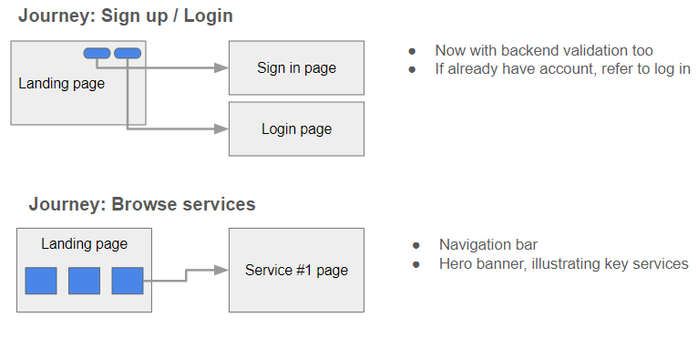
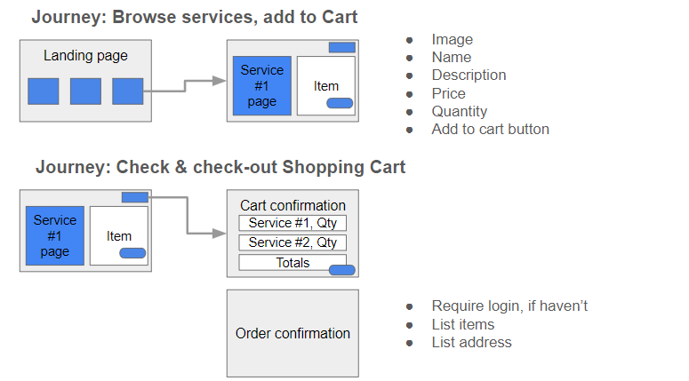

# Project 4: Condotierre 🖌🎨📊

## App introduction 📱
With the rise in popularity in board games and war gaming in Singapore, many players may choose to elevate their gaming experience, with intricate but unpainted character models and centrepieces such as dragons and hydras. [Condottiere](https://justintea-condottiere.cyclic.app/) delivers a variety of paint-related services to players, such as painting services and masterclasses, all in one secure app. Users can explore these services, set items to cart, confirm orders, and view their order history, and Superusers are able to view all orders, user addresses & contact details, and make related updates and deletes, with up to 10+ API requests. 

## Requirements for Project 🏗
 - A working full-stack, single-page application hosted online.
 - Be a complete product, which means that it is usable from head-to-tail, in the environment it is meant for.
 - Have a well-styled interactive front-end. Note: front-end does not mean javascript in the browser. Front-end can also mean HTML and CSS.
 - Communicates with the Server backend via AJAX.
 - Implement at least 10 API endpoints across all CRUD functions, e.g. 1 endpoint for Create, 1 for Read and so on
 - Use at least 10 API endpoints across the front-end.
 - Use a database or a way to store your data, whether that's one we've covered in class or one you want to learn
 - Have suitable validations for the database, client and server
 - Implement authentication. Including the ability of a user to sign-up, log in & log out with password hashing.
 - Implement authorisation by restricting CUD data functionality to authenticated users. Also, navigation should respond to the login status of the user.
 - Require at least 2 types of login, example user and admin, the different types should have different accesses to the APIs and Webpages
 - Implement full CRUD the app has to be able to create, read, update and delete data from the database
 - Have a well-scoped feature-set. Full-CRUD data operations are not required if one or more other features are included, for example:
   - Consume data from a third-party API.
   - Implement additional functionality if the user is an admin.
   - Implementation of a highly dynamic UI or data visualisation.
   - Other, instructor approved, complexity/features.

## Technologies Used 🚀
- ReactJS
- NodeJS
- Express
- MongoDB, MongoDB Compass
- JavaScript
- HTML
- CSS
- cyclic.sh for app deployment
- Ant Design

## Screenshots 📷
**- Initial wireframes**

**- Production wireframes**

**Journey #1: Browse services 👀**
<kbd></kbd>

<kbd></kbd>

**Journey #2: Sign up & login in 📝**
<kbd></kbd>
<kbd></kbd>

**Journey #3: Add & confirm Shopping cart 🛒**
<kbd></kbd>

**Journey #4: Order confirmation & history 🧮**
<kbd></kbd>

**Journey #5: User information ℹ️**
<kbd></kbd>

**Journey #6: Add, view, edit user address 🏡**
<kbd></kbd>
<kbd></kbd>

**Journey #7: Admin dashboard 🧑🏻‍💻**
<kbd></kbd>

## ERD & Trello 🛣
- [Entity Relation Diagram](https://lucid.app/lucidchart/bbe2fd71-8562-464d-a4a5-bd8dd2a56ed9/edit?viewport_loc=473%2C583%2C1375%2C997%2C0_0&invitationId=inv_7a122726-765d-4887-ae2a-78cf38e28ed5/)
- [Trello Kanban](https://trello.com/b/nCO9OSE1/condottiere/)

## Icebox Features 🧊
This app is created given a 1.5 weeks timeline. There are still many opportunities to improve the product, such as:
- **Improve admin data analytics 📊:** More admin "superuser" functionalities, such as visualisation of order data, or data export. 
- **Straight-through payment 💸:** User flow to link up to a e-payment provider or gateway.
- **Higher user engagement with email order confirmation & receipt 📩:** A more beautiful Order confirmation page, followed by sending of emails to the user.
- **Stronger app security 👮🏻‍♂️:** Implement robust security on backend code & Admin user functionality.

